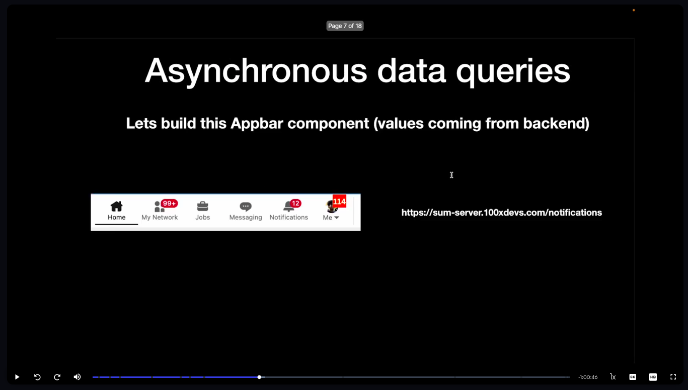

Things to learn

RECOIL

BASIC

- Atoms -> atoms are like state that stores data

- selectors
- Asynchronous data queries
- useRecoilState

- useRecoilValue -> it returns only value

- useSetRecoilState -> if you only need to update something and not actually want the value of it, in that case we use useSetRecoilState variable, it returns just the function not the initial value

ADVANCE

- atomFamily
- selectorFamily
- useRecoilStateLoadable
- useRecoilValueLoadable

SELECTORS

in the below image, lets suppose 104 number on the me tab is sum of all notification,
so how to achieve that?

do you need one more atom for that ? NO

Now lets discuss asynchronous data queries

